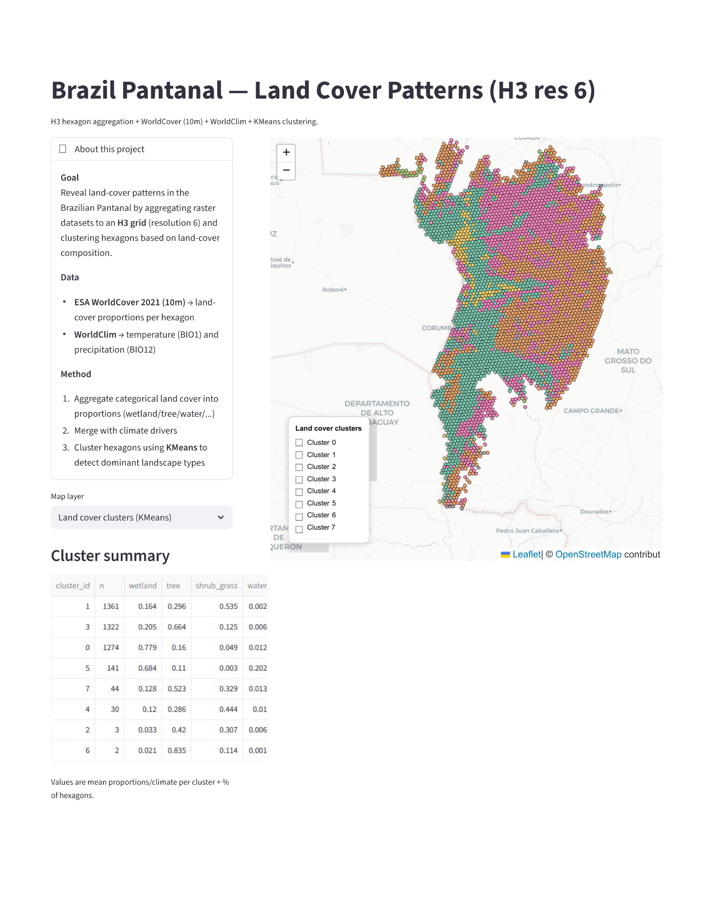

## Interactive Application

**Live demo:**: 

# Spatial Land Cover Patterns in the Brazilian Pantanal

This project analyzes land-cover patterns in the Brazilian Pantanal using a hexagonal H3 grid and environmental drivers derived from global raster datasets.

The objective is to move beyond descriptive land-cover maps by identifying spatially coherent landscape patterns and relating them to climate and land-cover composition through unsupervised clustering.

---

## Objectives

- Build a reproducible spatial data pipeline from raw raster data to analysis-ready features
- Aggregate land-cover and climate variables using an H3 hexagonal grid
- Identify dominant land-cover patterns through clustering techniques
- Support interpretation of spatial patterns using environmental drivers
- Deliver results through an interactive analytical application

---

## Study Area

- **Region:** Brazilian Pantanal biome  
- **Spatial unit:** H3 hexagons (resolution 6)

---

## Data Sources

- **Land Cover:** ESA WorldCover 2021 (10 m resolution)  
- **Climate:** WorldClim v2.1 (BIO1 – temperature, BIO12 – precipitation)  
- **Biome boundaries:** IBGE  

---

## Methodology Overview

1. Definition of the area of interest (Pantanal biome)
2. Generation of an H3 hexagonal grid (resolution 6)
3. Aggregation of categorical land-cover data into proportional features per hexagon
4. Integration of climate variables at the same spatial resolution
5. Unsupervised clustering (KMeans) to identify dominant land-cover patterns
6. Post-clustering analysis of environmental characteristics

---

## Interactive Application

An interactive Streamlit application is provided to explore the results.

The app allows users to:
- Visualize land-cover clusters spatially
- Inspect land-cover composition and climate attributes per hexagon
- Compare cluster profiles through summary tables

The application is designed as an analytical exploration tool rather than a static map.

*(Deployment link to be added)*

---

## Repository Structure

├── app/                    # Streamlit application
├── src/                    # Data processing and analysis scripts
├── data/
│   ├── raw/                # Raw raster and vector data
│   └── processed/          # Aggregated features and outputs
├── README.md
└── requirements.txt

---

## Project Status

Stable prototype.
Core data pipeline, clustering, and interactive visualization are implemented.

## Author

Natalie Spanghero
Geospatial Analyst — Spatial Data, Environmental Analysis, and Geospatial Analytics
